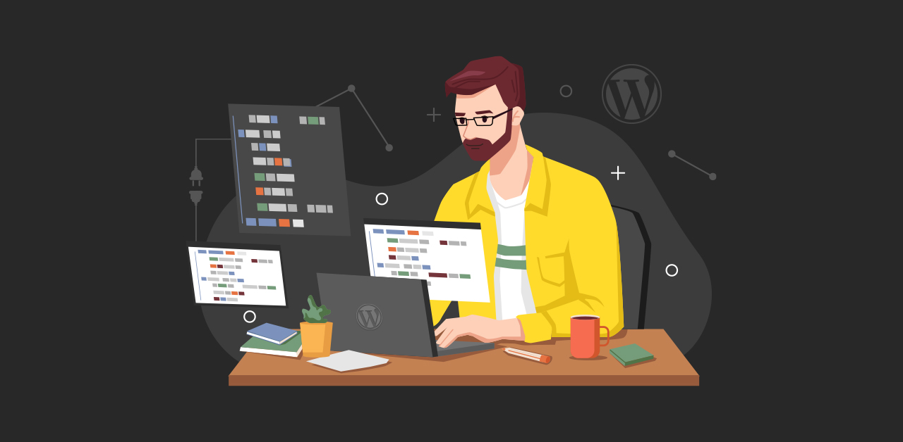

<!-- Trungquandev -->

<h2 align="center"> 🔥  Hello everyone , My name is Tuan Anh 🔥 </h2>

 I'm a FrontEnd developer (FE) 👽 

 
<!-- https://simpleicons.org/ -->

&nbsp;

&nbsp;

&nbsp;

&nbsp;

&nbsp;

&nbsp;

&nbsp;

&nbsp;

&nbsp;

&nbsp;

&nbsp;

&nbsp;

 
<h2 align="center">🔥 GitHub Stats 🔥</h2>
<!-- https://github.com/anuraghazra/github-readme-stats -->
 

  
  

 
<h2 align="center">👽 Where to find me 👽</h2>
 
<!-- https://icons8.com -->

  
  
  
  
  

  
 
